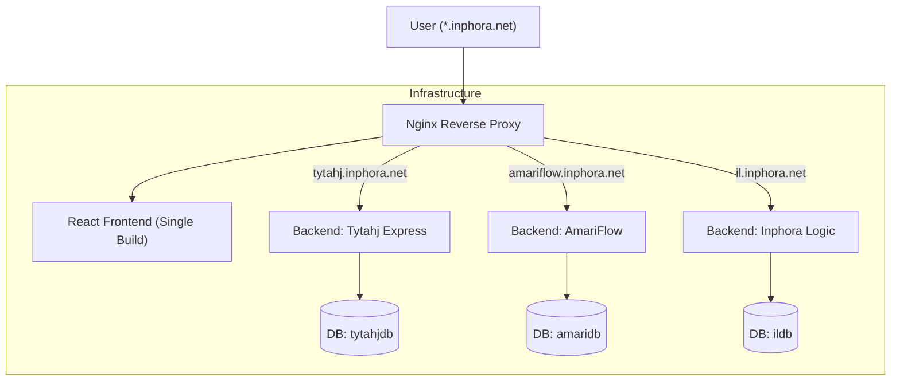

# Inphora Lending System

Inphora Lending System is a professional, multi-tenant digital lending management platform designed for micro-finance institutions. It provides a robust, secure, and isolated environment for multiple clients under a single infrastructure.

## 🚀 Multi-Tenant Architecture

The system uses a highly isolated architecture to ensure data security and performance for each client:

- **Isolated Databases**: Each client has their own dedicated MariaDB database.
- **Isolated Backends**: Each client runs a separate FastAPI backend instance, connecting only to its own database.
- **Unified Frontend**: A single React frontend build serves all clients, with dynamic branding (titles, favicons, logos) triggered by the subdomain.
- **Nginx Edge Router**: A centralized Nginx container handles SSL termination (Let's Encrypt) and intelligently routes requests to the correct backend based on the incoming subdomain.

### Architecture Diagram



## 🛠 Tech Stack

- **Backend**: Python 3.9, FastAPI, SQLAlchemy, Pydantic, PyMySQL.
- **Frontend**: React, Vite, Lucide React, Framer Motion, Axios.
- **Database**: MariaDB 10.6.
- **Proxy/SSL**: Nginx, Certbot (Let's Encrypt).
- **Containerization**: Docker, Docker Compose.

## 📦 Deployment

The project is packaged for deployment using a PowerShell script that prepares all necessary files for the server.

### 1. Preparation (Local)
Run the packager to create `deploy_package_v2.zip`:
```powershell
.\package_for_deploy.ps1
```

### 2. Transfer and Deploy (Server)
Transfer the package to your DigitalOcean droplet:
```bash
scp deploy_package_v2.zip root@YOUR_IP:/opt/inphora
```

On the server:
```bash
cd /opt/inphora
unzip -o deploy_package_v2.zip
cp .env.production .env
docker compose up -d --build
```

### 3. Initialize Databases
Create the initial admin users across all databases:
```bash
chmod +x init_databases.sh
./init_databases.sh
```

## 🌐 Active Clients

| Client | Domain |
| :--- | :--- |
| **Tytahj Express** | [tytahj.inphora.net](https://tytahj.inphora.net) |
| **AmariFlow** | [amariflow.inphora.net](https://amariflow.inphora.net) |
| **Inphora Logic** | [il.inphora.net](https://il.inphora.net) |

## 🔒 Security Practices

- **Environment Variables**: All sensitive data (DB passwords, secret keys) are stored in `.env` and are **excluded from Git**.
- **Isolation**: Clients share NO database resources; even a total compromise of one DB does not affect others.
- **SSL**: All traffic is forced to HTTPS via Nginx.
- **Passwords**: The default password `admin123` must be changed immediately upon first login.

---
© 2026 Inphora. Professional Financial Solutions.
